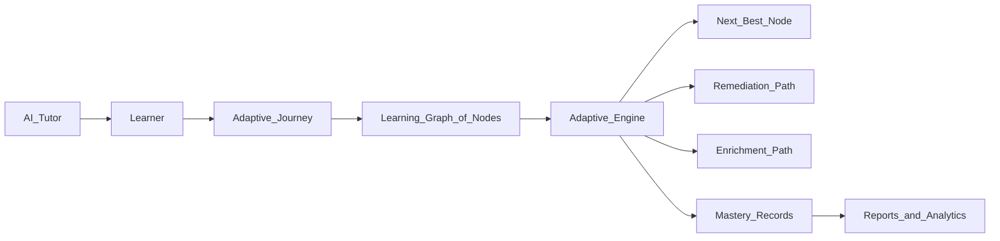
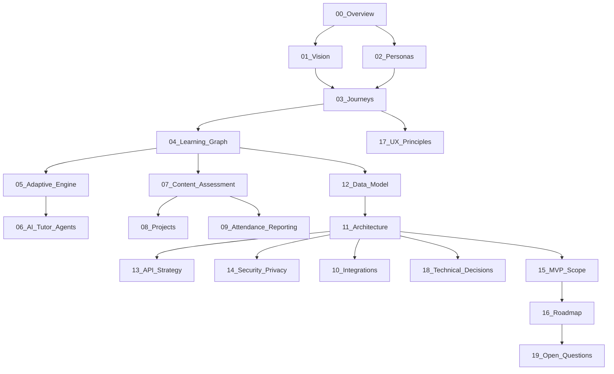

# 00 — Project Overview

> The-Code Adaptive LMS (codename `maestronexus`) — an AI-native, learner-centric adaptive Learning Management System.

## Repository and ownership

| Item | Value |
|------|-------|
| Canonical repository | https://github.com/tamers76/maestronexus |
| Clone | `git clone https://github.com/tamers76/maestronexus.git` |
| Maintainer | The-Code.org / The-Code.ai |
| Product name (placeholder) | The-Code Adaptive LMS / Project Adaptive LMS |
| Engineering codename | `maestronexus` (Maestro Nexus) |
| License | To be decided (see [19_open_questions.md](19_open_questions.md)) |

All engineering references, clone commands, CI configuration, and issue/PR tracking point at **`maestronexus`**. There is no alternate repository.

## Executive summary

The-Code Adaptive LMS is a next-generation learning platform that treats learning as an **adaptive journey through a graph of learning nodes** rather than a fixed sequence of chapters and lessons. Every learner receives a personalized path shaped by prior knowledge, performance, confidence, preferred modality, pace, and goals. An adaptive engine continuously answers a single guiding question:

> **What does this learner need next to reach mastery?**

The platform combines a node-based learning graph, an adaptive recommendation engine, an AI tutor grounded in approved course content, AI-assisted content creation with human review, multimodal content, deep skills and outcomes mapping, and analytics — all behind an API-first, modular architecture that is multi-tenant and interoperable from day one.

## The problem with traditional LMS platforms

| Weakness in legacy LMS | How The-Code Adaptive LMS responds |
|------------------------|------------------------------------|
| Mostly content repositories | Learning is modeled as a graph of typed nodes with rules, not a file dump |
| Assume one path for all learners | Adaptive engine routes each learner individually |
| Weak personalization | Per-learner profile, mastery records, and recommendations |
| Shallow understanding of progress | Mastery, confidence, attempts, time, and skill evidence tracked per node |
| No intelligent adaptation | Rule-based engine (MVP) evolving to AI-enhanced routing |
| Course-centric, not learner-centric | The learner is the primary unit of progress |
| No AI-native orchestration | AI tutor, content generation, and future multi-agent design are first-class |
| Poor multimodal support | Text, video, audio, interactive, simulation, project, and more |
| Siloed content/assessment/analytics/skills | One coherent domain model spanning all of these |

## What we are building (at a glance)

## Differentiators

1. **Graph-native curriculum** — courses are graphs (concepts, lessons, practice, assessments, mastery checks, remediation, enrichment), not linear shells.
2. **Mastery-first progression** — completion is not enough; mastery rules combine scores, submissions, teacher approval, and skill evidence.
3. **Grounded AI tutor** — answers come from approved course content with guardrails against answer-dumping and hallucination.
4. **Human-in-the-loop AI content** — AI drafts, humans review and approve, versions are stored.
5. **Skills intelligence** — outcomes and skills map to nodes, assessments, projects, weeks, and programs.
6. **API-first interoperability** — provider abstractions for identity, AI, storage, content standards, and communications.

## Glossary (canonical vocabulary)

These terms are defined once here and used consistently across all documents.

| Term | Definition |
|------|------------|
| **Tenant / Institution** | An isolated customer organization. All data is partitioned by `tenant_id`. |
| **Course** | A unit of curriculum owned by a tenant; published as one or more Course Versions. |
| **Course Version** | An immutable, published snapshot of a course's learning graph. |
| **Learning Node (Node)** | An atomic learning unit (concept, lesson, quiz, project, checkpoint, etc.) within a course graph. |
| **Node Dependency** | A directed relationship between nodes (`requires`, `mastery_gate`, `optional`, `parallel`). |
| **Learning Graph** | The full set of nodes and dependencies that compose a course. |
| **Learning Path / Journey** | A learner's personalized traversal of the learning graph over time. |
| **Mastery Record** | The evidence and status of a learner's mastery for a node or skill. |
| **Mastery Rule** | A composable rule that defines what "mastered" means for a node. |
| **Adaptive Engine** | The component that recommends the next best action for a learner. |
| **AI Tutor** | A grounded conversational assistant that supports (not replaces) learning. |
| **Skill / Competency** | A trackable capability that nodes develop and assessments evidence. |
| **Learning Outcome (CLO/PLO)** | Course or Program Learning Outcome mapped to nodes, assessments, and skills. |
| **Class / Cohort** | A group of learners managed by a teacher. |
| **Enrollment** | The association of a learner with a course/class/journey. |
| **Object-level permission** | An access rule scoped to a specific object (e.g. a teacher's own class). |

## Stakeholders

| Stakeholder | Interest |
|-------------|----------|
| The-Code.org / The-Code.ai | Product owner and maintainer |
| Learners | Personalized, self-paced mastery |
| Teachers / Instructors | Class management, grading, learner support |
| Course / Instructional Designers | Authoring the learning graph and outcomes |
| Admins | Tenant, user, role, integration, and AI configuration |
| Institution Leaders | Outcomes, effectiveness, engagement dashboards |
| Parents / Guardians (future) | Visibility into learner progress |

## North-star metrics

| Category | Candidate KPI |
|----------|---------------|
| Learning effectiveness | Median time-to-mastery per node; mastery rate |
| Personalization quality | Share of learners receiving (and accepting) adaptive recommendations |
| Engagement | Weekly active learners; nodes completed per active learner |
| Teacher leverage | Learners effectively supported per teacher; grading turnaround |
| AI value | Tutor sessions that resolve without escalation; reviewed AI content accepted |
| Platform health | API uptime, p95 latency, error budget adherence |

## Document map

## Reading guidance for implementers

- Start here, then read [15_mvp_scope.md](15_mvp_scope.md) and [16_roadmap.md](16_roadmap.md) to understand what to build first.
- The domain core is [04_learning_graph_model.md](04_learning_graph_model.md) and [12_data_model.md](12_data_model.md).
- Architecture and platform decisions live in [11_system_architecture.md](11_system_architecture.md) and [18_technical_decisions.md](18_technical_decisions.md).

---

Repository: https://github.com/tamers76/maestronexus | Maintainer: The-Code.org / The-Code.ai
