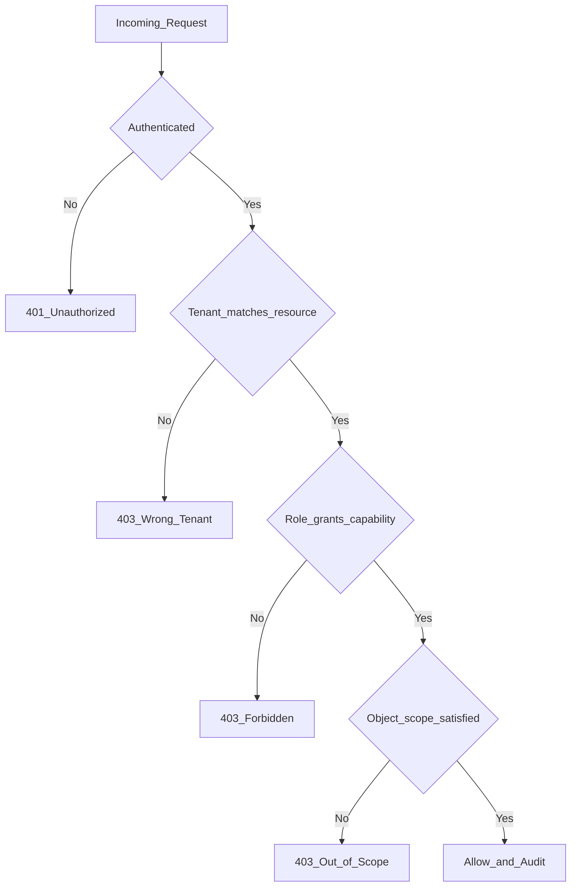

# 02 — Personas and Permissions

> Who uses The-Code Adaptive LMS (`maestronexus`), what they can do, and how access is enforced.

## Personas

### Learner
Receives a personalized, self-paced learning journey.

- See assigned courses and journeys.
- Move through adaptive nodes; complete lessons, quizzes, activities, projects.
- Receive AI coaching and ask the AI tutor questions.
- Get feedback; view progress and mastery.
- Submit projects (individually, even when collaborative).
- Receive recommendations for what to do next.

### Teacher / Instructor
Supports and assesses learners in their own classes. **Does not** access course setup or system-wide admin configuration unless explicitly granted.

- View only their own classes, learners, and groups.
- View lessons/nodes assigned to their classes; assign lessons/nodes to learners.
- Track attendance for their classes.
- View reports for their own classes.
- Grade projects and review submissions; give feedback.
- View learner progress and risk indicators.
- Use AI assistance to support teaching.

### Admin
Manages the platform within their scope.

- Create institutions, departments, programs, courses.
- Create node-based learning journeys.
- Manage users, roles, permissions, integrations, content libraries, AI settings, analytics.
- Configure learning standards and skills frameworks.

### Course Designer / Instructional Designer
Builds the learning experience.

- Create courses; define learning outcomes.
- Build learning nodes; map prerequisites; create learning paths.
- Add multimodal content; create assessments; define mastery rules.
- Use AI to generate content, quizzes, alternative explanations, remediation paths.
- Map CLOs to weeks, lessons, nodes, skills, and assessments.

### Parent / Guardian (future)
- View learner progress, attendance, achievements, recommendations.
- Receive notifications.

### Institution Leader
- View dashboards; track outcomes, effectiveness, teacher performance, engagement, completion, skill development.
- Export reports.

### Teaching Assistant
- Scoped subset of teacher capabilities (grading and feedback assist) without class ownership; configurable.

### External Evaluator
- Read-only, time-boxed access to specific submissions/assessments for review or accreditation.

### Content Creator
- Authoring of content items and media without full course architecture rights.

## Roles

| Role | Primary scope |
|------|---------------|
| Super Admin | Cross-tenant platform operator |
| Institution Admin | One tenant |
| Program Admin | One or more programs within a tenant |
| Course Designer | Courses they own or are assigned |
| Teacher | Their own classes |
| Teaching Assistant | Assigned classes (assist only) |
| Learner | Their own learning space |
| Parent / Guardian | Linked learners (future) |
| External Evaluator | Granted artifacts, time-boxed |
| Content Creator | Content authoring surfaces |

## RBAC capability matrix

Legend: ✅ allowed · 🟡 allowed if explicitly granted · 🔒 own objects only · ➖ not allowed

| Capability | Super Admin | Inst. Admin | Program Admin | Course Designer | Teacher | TA | Learner | Inst. Leader | Parent | Ext. Evaluator | Content Creator |
|------------|:----------:|:-----------:|:-------------:|:---------------:|:-------:|:--:|:-------:|:------------:|:------:|:--------------:|:---------------:|
| Manage tenants | ✅ | ➖ | ➖ | ➖ | ➖ | ➖ | ➖ | ➖ | ➖ | ➖ | ➖ |
| Manage users & roles | ✅ | ✅ | 🟡 | ➖ | ➖ | ➖ | ➖ | ➖ | ➖ | ➖ | ➖ |
| Configure integrations & AI settings | ✅ | ✅ | 🟡 | ➖ | ➖ | ➖ | ➖ | ➖ | ➖ | ➖ | ➖ |
| Create/edit courses | ✅ | ✅ | ✅ | ✅ | 🟡 | ➖ | ➖ | ➖ | ➖ | ➖ | ➖ |
| Build learning graph / nodes | ✅ | ✅ | ✅ | ✅ | 🟡 | ➖ | ➖ | ➖ | ➖ | ➖ | ➖ |
| Define mastery & outcomes | ✅ | ✅ | ✅ | ✅ | 🟡 | ➖ | ➖ | ➖ | ➖ | ➖ | ➖ |
| Author content items | ✅ | ✅ | ✅ | ✅ | 🟡 | ➖ | ➖ | ➖ | ➖ | ➖ | ✅ |
| Generate AI content (draft) | ✅ | ✅ | ✅ | ✅ | 🟡 | ➖ | ➖ | ➖ | ➖ | ➖ | 🟡 |
| Approve AI content | ✅ | ✅ | ✅ | ✅ | 🟡 | ➖ | ➖ | ➖ | ➖ | ➖ | ➖ |
| Manage classes/cohorts | ✅ | ✅ | ✅ | 🟡 | 🔒 | ➖ | ➖ | ➖ | ➖ | ➖ | ➖ |
| Assign nodes/lessons to learners | ✅ | ✅ | ✅ | 🟡 | 🔒 | 🔒 | ➖ | ➖ | ➖ | ➖ | ➖ |
| Take attendance | ✅ | ✅ | ✅ | ➖ | 🔒 | 🔒 | ➖ | ➖ | ➖ | ➖ | ➖ |
| Grade projects | ✅ | ✅ | ✅ | ➖ | 🔒 | 🔒 | ➖ | ➖ | ➖ | 🟡 | ➖ |
| View class reports | ✅ | ✅ | ✅ | 🟡 | 🔒 | 🔒 | ➖ | ➖ | ➖ | ➖ | ➖ |
| View institution dashboards | ✅ | ✅ | 🟡 | ➖ | ➖ | ➖ | ➖ | ✅ | ➖ | ➖ | ➖ |
| Progress through nodes | ➖ | ➖ | ➖ | ➖ | ➖ | ➖ | ✅ | ➖ | ➖ | ➖ | ➖ |
| Submit projects | ➖ | ➖ | ➖ | ➖ | ➖ | ➖ | 🔒 | ➖ | ➖ | ➖ | ➖ |
| Use AI tutor | ➖ | ➖ | ➖ | ➖ | ➖ | ➖ | ✅ | ➖ | ➖ | ➖ | ➖ |
| View own child progress | ➖ | ➖ | ➖ | ➖ | ➖ | ➖ | ➖ | ➖ | 🔒 | ➖ | ➖ |
| Review assigned artifacts | ➖ | ➖ | ➖ | ➖ | ➖ | ➖ | ➖ | ➖ | ➖ | 🔒 | ➖ |
| Read audit logs | ✅ | ✅ | 🟡 | ➖ | ➖ | ➖ | ➖ | ➖ | ➖ | ➖ | ➖ |

> **Critical rule, repeated across docs:** Teachers do not get course setup or system-wide admin configuration unless a role/permission is explicitly granted. The default teacher experience is class-scoped.

## Object-level permissions (scopes)

RBAC answers "what kind of action," scopes answer "on which objects." Both must pass.

| Scope | Meaning |
|-------|---------|
| Tenant scope | Every request is bound to a `tenant_id`; cross-tenant access is impossible except for Super Admin operations. |
| Org scope | Program/department membership narrows what an admin or leader can see. |
| Ownership scope | Teachers/TAs act only on their own classes, learners, attendance, and submissions (`🔒`). |
| Learner scope | Learners act only within their own learning space. |
| Time-boxed scope | External evaluators get access windows with expiry. |

## Permission enforcement model

Enforcement layers, in order:
1. **Authentication** — valid session/token.
2. **Tenant isolation** — resource `tenant_id` equals caller's tenant.
3. **Role check (RBAC)** — role grants the capability.
4. **Object-level scope** — ownership/membership/time window satisfied.
5. **Audit** — every privileged action is written to the audit log (see [14_security_and_privacy.md](14_security_and_privacy.md)).

## Identity capabilities

- Multi-tenant institutions with isolated data.
- SSO via OIDC/SAML; future support for national identity systems (e.g. UAE Pass) where feasible.
- Audit logs for privileged actions.

See [14_security_and_privacy.md](14_security_and_privacy.md) for tenancy isolation and audit details, and [10_integrations_and_interoperability.md](10_integrations_and_interoperability.md) for identity providers.

---

Repository: https://github.com/tamers76/maestronexus | Maintainer: The-Code.org / The-Code.ai
