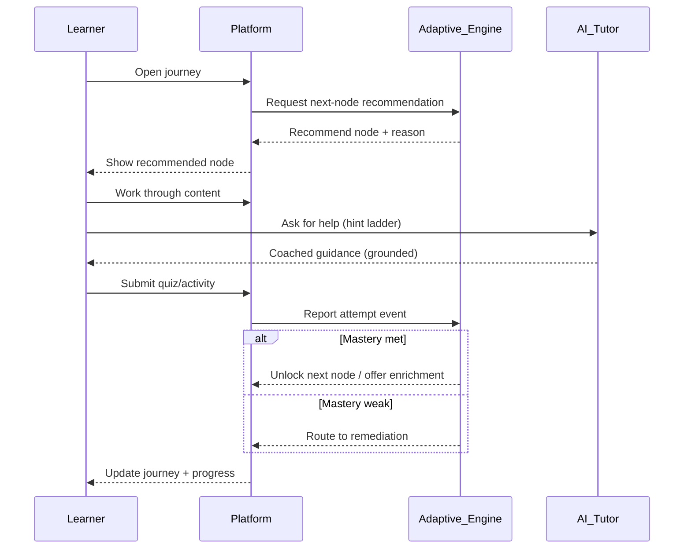
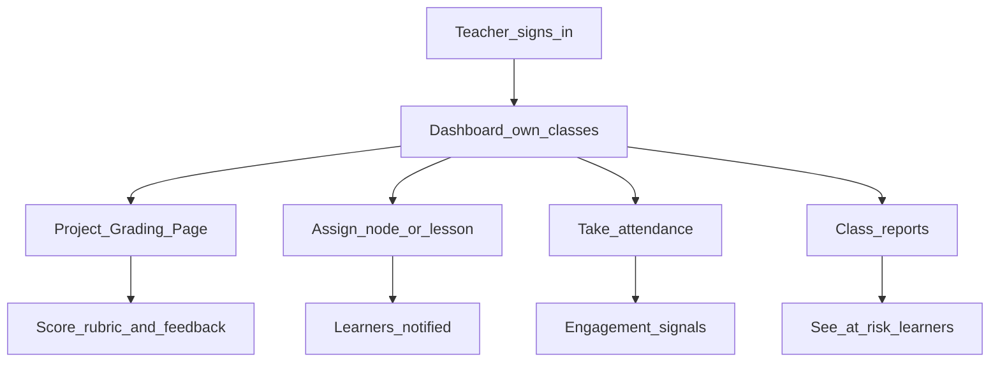

# 03 — Core User Journeys

> End-to-end flows for the primary personas of The-Code Adaptive LMS (`maestronexus`). See [02_personas_and_permissions.md](02_personas_and_permissions.md) for roles and scopes.

## Learner journey: adaptive progression

The learner enrolls, receives a recommended node, works through it, is assessed, and is routed to mastery, remediation, or enrichment.



Edge cases:
- Repeated failure → engine recommends alternate modality, then teacher escalation ([05_adaptive_learning_engine.md](05_adaptive_learning_engine.md)).
- Teacher assignment present → overrides engine suggestion.
- Locked node → learner is shown the prerequisite/mastery gate to clear.

## Teacher journey: class management and grading

Teachers operate strictly within their own classes.



Notes:
- The project grading page sits in navigation **after the dashboard** ([08_project_based_learning.md](08_project_based_learning.md)).
- All views are class-scoped; no course setup unless explicitly granted.

## Designer journey: build a course graph

```mermaid
flowchart LR
  New[Create_course] --> Outcomes[Define_CLOs_and_skills]
  Outcomes --> Nodes[Create_learning_nodes]
  Nodes --> Deps[Map_prerequisites_and_mastery_gates]
  Deps --> Content[Add_multimodal_content]
  Content --> AIgen[Optionally_generate_AI_drafts]
  AIgen --> Review[Human_review_and_approve]
  Review --> Map[Map_CLOs_to_nodes_and_assessments]
  Map --> Publish[Publish_Course_Version]
```



The designer uses the visual learning-graph editor ([04_learning_graph_model.md](04_learning_graph_model.md)); AI drafts always pass human review ([07_content_and_assessment_model.md](07_content_and_assessment_model.md)).

## Admin journey: tenant setup

```mermaid
flowchart LR
  Tenant[Create_or_configure_tenant] --> Org[Departments_Programs]
  Org --> Users[Provision_users_and_roles]
  Users --> SSO[Configure_SSO_OIDC_SAML]
  SSO --> Integrations[Configure_integrations]
  Integrations --> AI[Configure_AI_settings_and_quotas]
  AI --> Frameworks[Configure_skills_and_standards]
```



Admin scope and integration providers are covered in [02_personas_and_permissions.md](02_personas_and_permissions.md) and [10_integrations_and_interoperability.md](10_integrations_and_interoperability.md).

## Cross-journey: AI tutor escalation

```mermaid
sequenceDiagram
  participant L as Learner
  participant Tutor as AI_Tutor
  participant Sys as Platform
  participant T as Teacher
  L->>Tutor: I'm stuck after several tries
  Tutor->>Tutor: Run hint ladder; detect persistent difficulty
  Tutor->>Sys: Create escalation + summary
  Sys->>T: Notify (own class): learner needs help
  T->>Sys: Assign resource / reach out
  Sys->>L: New recommendation / teacher contact
```

## Implications for implementation

- Drive the learner journey from recommendations, not from a fixed lesson list.
- Gate every teacher and admin action by tenant and object scope at the API layer.
- Surface the recommendation `reason` in the UI so the next step is always explained ([17_ux_principles.md](17_ux_principles.md)).

---

Repository: https://github.com/tamers76/maestronexus | Maintainer: The-Code.org / The-Code.ai
