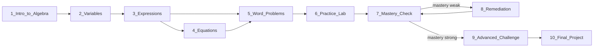
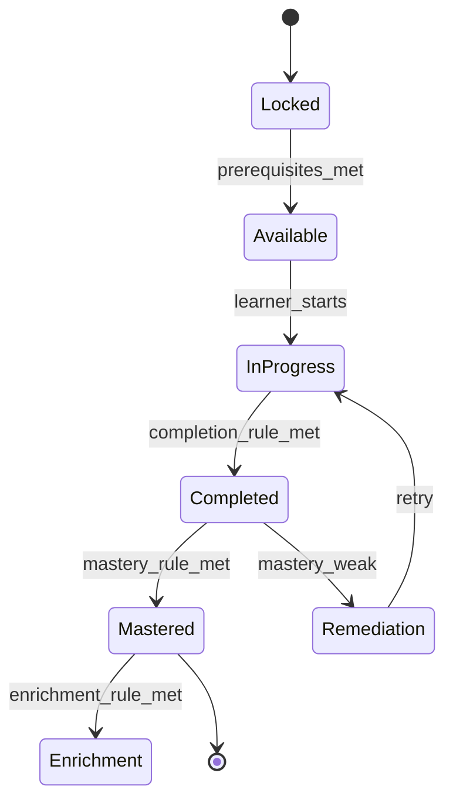
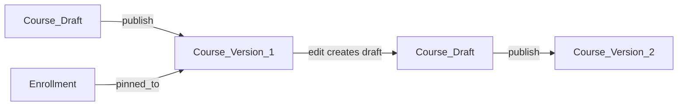

# 04 — Learning Graph Model

> The heart of The-Code Adaptive LMS (`maestronexus`): courses are graphs of learning nodes, not linear lists.

## Concept

A course is a **directed graph**. Nodes are atomic learning units; edges are dependencies. A learner's journey is a personalized traversal of this graph, governed by node availability rules and the adaptive engine ([05_adaptive_learning_engine.md](05_adaptive_learning_engine.md)).

In this example: Node 2 requires Node 1; Node 3 requires Node 2; Node 5 requires Nodes 3 and 4; Node 9 requires mastery in Node 7; Node 8 (remediation) is triggered when mastery at Node 7 is weak.

## Node taxonomy

| Node type | Purpose |
|-----------|---------|
| `lesson` | Core instructional unit |
| `concept` | A single idea or definition |
| `micro_lesson` | A short, focused lesson |
| `video` | Video-based instruction |
| `reading` | Text/document content |
| `quiz` | Formative or summative questions |
| `assignment` | Graded task |
| `project` | Larger, often multi-session deliverable |
| `reflection` | Metacognitive prompt |
| `discussion` | Peer/teacher discussion |
| `practice` | Drill / practice activity |
| `simulation` | Interactive simulation |
| `lab` | Hands-on lab |
| `assessment` | Formal assessment |
| `mastery_checkpoint` | Gate that verifies mastery |
| `remediation` | Targeted re-teaching path |
| `enrichment` | Extension/challenge content |
| `external_content` | LTI/SCORM/embedded third-party |
| `live_session` | Synchronous session |

## Node schema (conceptual)

Every node carries:

| Field | Description |
|-------|-------------|
| `id` | Stable identifier |
| `title` | Display title |
| `description` | Summary |
| `type` | One of the node types above |
| `learning_objective` | What the learner should achieve |
| `skills` | Skills/competencies developed (see [07](07_content_and_assessment_model.md)) |
| `prerequisites` | Incoming dependencies |
| `estimated_duration` | Expected time to complete |
| `content_items` | Attached content (text, video, etc.) |
| `assessment_items` | Attached assessments/questions |
| `mastery_rule` | When the node is considered mastered |
| `completion_rule` | When the node is considered complete |
| `remediation_rule` | What triggers remediation and where it routes |
| `enrichment_rule` | What unlocks enrichment |
| `metadata` | Tags, difficulty, modality, language |
| `version` | Node version within a course version |

Field-level persistence is defined in [12_data_model.md](12_data_model.md).

## Dependency types

| Dependency | Meaning |
|------------|---------|
| `requires` | Target node is locked until source node is completed |
| `mastery_gate` | Target node is locked until source node is **mastered** (not merely completed) |
| `optional` | Suggested but not required |
| `parallel` | May be taken in any order relative to siblings |
| `remediation_of` | Source remediates a specific node; entered when mastery is weak |
| `enrichment_of` | Source enriches a specific node; entered when mastery is strong |

## Path types

| Path | Description |
|------|-------------|
| Linear | Straight prerequisite chain |
| Branching | Multiple viable next nodes |
| Optional | Side nodes that do not block progress |
| Remediation loop | Re-teach then re-check mastery |
| Enrichment branch | Extension for strong learners |
| Mastery gate | Hard gate requiring demonstrated mastery |
| Prerequisite chain | Ordered dependencies |
| Parallel | Independent nodes completed in any order |
| AI-recommended sequencing | Engine-proposed order (Phase 2+) |

## Node availability state machine

Per learner, each node moves through states:

- **Locked** → prerequisites/mastery gates not satisfied.
- **Available** → unlocked; recommended or selectable.
- **In Progress** → started but not complete.
- **Completed** → completion rule satisfied.
- **Mastered** → mastery rule satisfied (this, not completion, unlocks mastery gates).
- **Remediation** → routed to re-teaching when mastery is weak.
- **Enrichment** → optional extension after mastery.

## Course vs Course Version vs published graph

- A **Course** is the editable container.
- A **Course Version** is an immutable, published snapshot of the graph used for enrollments; learners are pinned to a version for stability.
- Editing a published course creates a new draft that becomes the next version on publish. See versioning conventions in [12_data_model.md](12_data_model.md).

## Visual learning-graph editor

For designers/admins (see [02_personas_and_permissions.md](02_personas_and_permissions.md)).

| Capability | MVP | Future |
|------------|:---:|:------:|
| Create/edit nodes | ✅ | ✅ |
| Draw prerequisite connections | ✅ | ✅ |
| Dependency mapping (requires/mastery_gate) | ✅ | ✅ |
| Basic remediation/enrichment edges | ✅ | ✅ |
| Drag-and-drop canvas | ✅ (basic) | ✅ (rich) |
| Adaptive branching authoring | Basic rules | ✅ Advanced |
| AI-suggested learning sequences | ➖ | ✅ |
| Manual override of AI suggestions | ➖ | ✅ |

Recommended UI library: **React Flow** (`@xyflow/react`) — see [18_technical_decisions.md](18_technical_decisions.md).

## Implications for implementation

- Store nodes and dependencies as first-class entities; never encode order implicitly via arrays only.
- Node availability is computed per learner from progress + dependencies; cache results and recompute on relevant events (attempt completion, mastery change).
- Mastery (not completion) is what satisfies `mastery_gate` edges.
- The adaptive engine reads this graph; it does not own it (see [05_adaptive_learning_engine.md](05_adaptive_learning_engine.md)).

---

Repository: https://github.com/tamers76/maestronexus | Maintainer: The-Code.org / The-Code.ai
