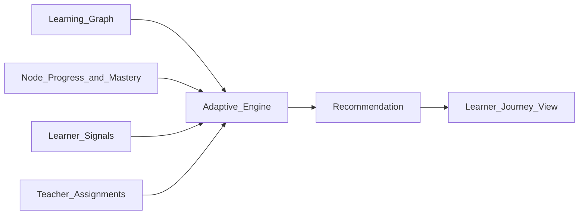
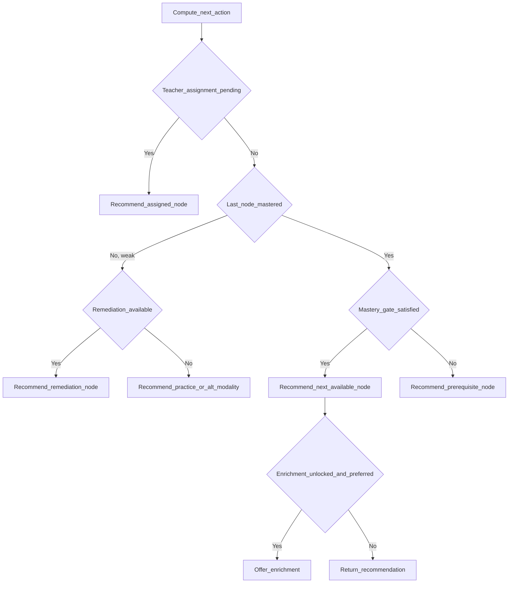

# 05 — Adaptive Learning Engine

> The component that decides what each learner should do next in The-Code Adaptive LMS (`maestronexus`).

## Responsibility

The adaptive engine consumes the learning graph ([04_learning_graph_model.md](04_learning_graph_model.md)) and per-learner progress ([12_data_model.md](12_data_model.md)) and produces a **Recommendation**: the next best action toward mastery. It does not own the graph and it does not publish content; it reads state and writes recommendations.

## Inputs (signals)

| Signal | Source |
|--------|--------|
| Node completion / state | `NODE_PROGRESS` |
| Quiz / assessment scores | `ATTEMPT` |
| Confidence level | Learner self-report + inferred |
| Time spent | `NODE_PROGRESS.time_spent_seconds` |
| Number of attempts | `NODE_PROGRESS.attempts` |
| Skills mastered / weak | `MASTERY_RECORD` |
| Missing prerequisites | `NODE_DEPENDENCY` + progress |
| Learner preferences (modality, pace) | `LEARNER_PROFILE` |
| Teacher assignments | `TEACHER_ASSIGNMENT` / assignment records |
| AI tutor signals | `AI_INTERACTION` (Phase 3) |
| Engagement patterns | Activity events |

## Outputs (recommendation types)

- Next best node.
- Remediation node (when mastery is weak).
- Practice activity.
- Alternative explanation / different modality (e.g. video instead of reading).
- Challenge / enrichment activity.
- Human teacher intervention (escalation).
- Project-based application.
- Peer collaboration.

## MVP: rule-based engine

Deterministic, explainable, and cheap. Every recommendation carries a human-readable `reason`.

### Decision flow

### Decision table (illustrative)

| Condition | Recommendation | Reason |
|-----------|----------------|--------|
| Teacher assigned a node and it is incomplete | Assigned node | "Assigned by your teacher" (override wins) |
| Last assessment score below mastery threshold and remediation exists | Remediation node | "Strengthen weak concepts before moving on" |
| Score below threshold, no remediation, multiple attempts | Alternative modality / practice | "Try a different explanation" |
| Node mastered and next node available | Next available node | "Continue your path" |
| Next node behind a mastery gate not yet satisfied | Prerequisite/mastery node | "Master X to unlock Y" |
| Node mastered, enrichment unlocked, learner prefers challenge | Enrichment node | "Optional challenge available" |
| Repeated failure across attempts and time | Escalate to teacher | "Recommended teacher support" |

### Override and precedence rules

1. **Teacher assignment wins** over engine suggestions.
2. **Mastery gates are hard** — never recommend a gated node before its gate is satisfied.
3. **Prerequisites are hard** — never recommend a locked node.
4. Enrichment is always **optional**; never blocks progression.
5. Every recommendation is logged with its `source` (`rule_engine` for MVP) and `reason`.

### Thresholds (configurable defaults)

| Parameter | Default | Configurable by |
|-----------|---------|-----------------|
| Mastery score threshold | 80% | Designer per node |
| Max attempts before alternate modality | 2 | Designer/admin |
| Max attempts before teacher escalation | 4 | Designer/admin |
| Confidence floor for "ready to advance" | medium | Admin |

## Future: AI-enhanced engine (Phase 2–3+)

The rule engine remains the safety net; AI augments ranking and personalization.

| Aspect | Rule-based (MVP) | AI-enhanced (Future) |
|--------|------------------|----------------------|
| Next-node selection | Decision table | Learned ranking over candidate nodes |
| Modality choice | Preference + simple rules | Predicted best modality per learner/moment |
| Difficulty | Static thresholds | Dynamic difficulty adaptation |
| Remediation content | Pre-authored | AI-generated (reviewed) remediation |
| Risk detection | Threshold flags | Predictive at-risk modeling |
| Explainability | Always | Required; AI proposes, rules constrain |

Design principles for the AI phase:
- **Human-in-the-loop**: AI ranks; hard constraints (prerequisites, mastery gates, teacher overrides) are enforced by rules.
- **Feature store**: signals above are materialized as features.
- **Bounded**: AI never unlocks gated content or fabricates mastery.

## API touchpoints

| Endpoint | Purpose |
|----------|---------|
| `GET /api/v1/learners/{id}/next-node` | Current top recommendation |
| `GET /api/v1/enrollments/{id}/recommendations` | Ranked recommendation list |
| `POST /api/v1/enrollments/{id}/events` | Report attempt/completion events that trigger recompute |

Recommendations are recomputed on relevant domain events (attempt completed, mastery changed, teacher assignment created). See [13_api_strategy.md](13_api_strategy.md).

## Implications for implementation

- Implement the engine as a pure function of (graph, progress, signals, overrides) → recommendation, so it is testable and explainable.
- Persist recommendations to `RECOMMENDATION` with `source` and `reason` for transparency and analytics.
- Keep AI behind the same interface so MVP rules and future models are swappable without changing callers.

---

Repository: https://github.com/tamers76/maestronexus | Maintainer: The-Code.org / The-Code.ai
