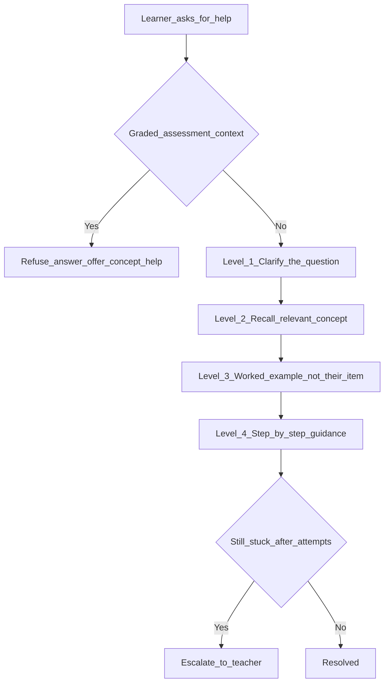
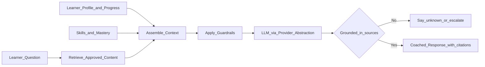

# 06 — AI Tutor and Agents

> How The-Code Adaptive LMS (`maestronexus`) uses AI to support — never replace — learning.

## Guiding principle

> The AI tutor should support learning, not replace it.

The tutor coaches, explains, and diagnoses. It does not hand out answers to graded work, complete assignments, or fabricate facts. All assistance is grounded in approved course content with explicit guardrails.

## AI tutor capabilities

- Explain concepts; answer learner questions.
- Give hints (graduated, not full solutions).
- Generate examples; diagnose misunderstandings.
- Recommend practice; summarize lessons.
- Create study plans; encourage reflection.
- Support different learner levels and multimodal explanations.
- Escalate to a teacher when appropriate.

## What the tutor must not do

| Prohibited | Mitigation |
|------------|------------|
| Give direct answers to graded work | Hint ladder; refuse on assessment items |
| Complete assignments/projects | Detect assessment context; coach instead |
| Encourage cheating | Academic-integrity guardrail |
| Hallucinate facts | RAG grounding + "I don't know" fallback |
| Act outside course content without clarity | Scope to approved content; cite sources |
| Leak other learners' or tenants' data | Strict per-learner, per-tenant context |

## The hint ladder

## Grounding (RAG)

The tutor retrieves only from **approved** content for the learner's course/version, plus the learner's own context.

Context sources:
- Approved course content (via vector + keyword retrieval; see [12_data_model.md](12_data_model.md)).
- Learner profile, progress, skills map, assessment results.
- Tenant- and course-scoped only.

## Guardrails

| Guardrail | Description |
|-----------|-------------|
| Content grounding | Responses must be supported by retrieved approved content; otherwise fall back. |
| Assessment integrity | Detect graded-item context; switch to coaching mode. |
| PII protection | No exposure of other users' data; minimize learner PII in prompts. |
| Hallucination control | Cite sources; "I don't know" is acceptable; encourage teacher escalation. |
| Logging | Every interaction stored in `AI_INTERACTION` for audit and quality (see [14_security_and_privacy.md](14_security_and_privacy.md)). |
| Provider abstraction | Swap LLM providers without changing tutor logic (see [18_technical_decisions.md](18_technical_decisions.md)). |
| Rate/cost limits | Per-tenant quotas and budgets. |

## AI content generation (overview)

Authorized designers/admins can generate drafts (lessons, quizzes, explanations, rubrics, summaries, flashcards, remediation/enrichment content, video scripts, discussion/reflection prompts). All drafts pass through human review before publication. The full workflow lives in [07_content_and_assessment_model.md](07_content_and_assessment_model.md).

## Agent catalog

The system is designed for multiple agents. For the MVP, only the **Learner Tutor Agent** and a constrained **Content Draft** capability are implemented; the rest are designed now and built later.

| Agent | Purpose | MVP | Future |
|-------|---------|:---:|:------:|
| Learner Tutor Agent | Coach learners through content and progress | ✅ | ✅ |
| Course Design Agent | Help designers build paths, nodes, assessments, remediation | Draft only | ✅ |
| Assessment Agent | Generate quizzes, rubrics, feedback, mastery checks | Draft only | ✅ |
| Analytics Agent | Find weak learners, content, and course structures | ➖ | ✅ |
| Content Transformation Agent | Text → video script, summary, flashcards, diagrams | ➖ | ✅ |
| Integration Agent | Map external/imported content into the node model | ➖ | ✅ |
| Admin Assistant Agent | Surface system status, usage, adoption, risks | ➖ | ✅ |

## Escalation to teacher

When the learner remains stuck after the hint ladder, or signals frustration, the tutor:
1. Summarizes the difficulty (concept, attempts, where they got stuck).
2. Creates a teacher notification (see [09_attendance_and_reporting.md](09_attendance_and_reporting.md) and [13_api_strategy.md](13_api_strategy.md)).
3. Suggests resources the teacher can assign.

## Implications for implementation

- Put all LLM access behind a provider-abstraction interface; never call a vendor SDK directly from feature code.
- Store every interaction (`AI_INTERACTION`) and every draft (`AI_GENERATED_CONTENT`) with review status.
- Enforce grounding and assessment-integrity checks server-side, not just via prompt instructions.

---

Repository: https://github.com/tamers76/maestronexus | Maintainer: The-Code.org / The-Code.ai
