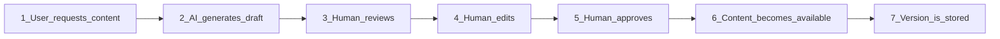
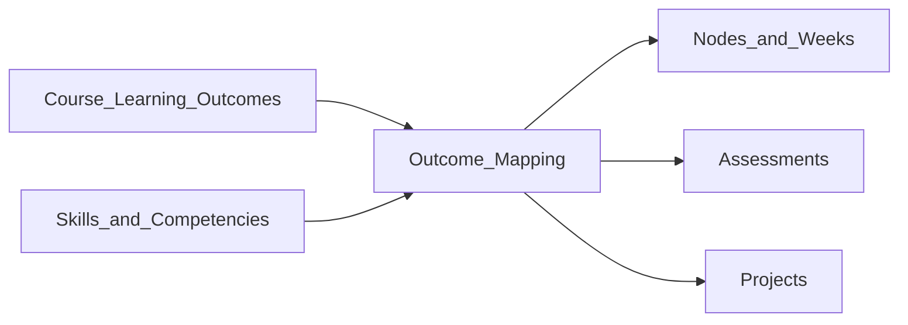

# 07 — Content and Assessment Model

> How content, assessment, and mastery work together in The-Code Adaptive LMS (`maestronexus`).

## Content items

Content items attach to learning nodes ([04_learning_graph_model.md](04_learning_graph_model.md)) and are modality-typed and versioned.

| Modality | Examples |
|----------|----------|
| Text | Lessons, readings |
| Video | Hosted or embedded video |
| Audio | Narration, podcasts |
| Interactive | Exercises, H5P-style activities |
| Simulation | Interactive models/labs |
| Quiz | Question sets |
| Project | Briefs and deliverables |
| Image / Diagram | Figures, concept maps |
| Slides / PDF | Presentations, documents |
| SCORM / external | Packaged or third-party (see [10_integrations_and_interoperability.md](10_integrations_and_interoperability.md)) |
| AI-generated explanation | Reviewed alternative explanations |
| Live session | Synchronous events |

### Versioning and approval

- Content items carry a `version` and an `approval_status` (`draft`, `in_review`, `approved`, `archived`).
- Only `approved` content is served to learners and is retrievable by the AI tutor ([06_ai_tutor_and_agents.md](06_ai_tutor_and_agents.md)).
- Editing approved content creates a new version; published course versions reference specific content versions for stability.

## Multimodal recommendation (Future)

The platform aims to recommend the best modality for the moment. If a learner struggles with a text explanation, the engine ([05_adaptive_learning_engine.md](05_adaptive_learning_engine.md)) may recommend a short video, a diagram, a simulation, a simpler explanation, a practice activity, or a teacher intervention.

| Capability | MVP | Future |
|------------|:---:|:------:|
| Store multiple modalities per node | ✅ | ✅ |
| Manual "try another explanation" | ✅ | ✅ |
| AI-driven best-modality recommendation | ➖ | ✅ |

## Assessment

### Assessment types

| Type | Purpose |
|------|---------|
| Diagnostic | Establish prior knowledge |
| Formative quiz | Low-stakes practice/feedback |
| Summative quiz | Graded knowledge check |
| Project | Applied deliverable (see [08_project_based_learning.md](08_project_based_learning.md)) |
| Reflection | Metacognition |
| Peer review | Learner-to-learner evaluation |
| Teacher grading | Human assessment |
| AI-assisted feedback | Draft feedback for human review (Future) |
| Oral assessment | Spoken evaluation |
| Practical task | Hands-on demonstration |
| Simulation-based | Performance in a simulation |

### Question bank and attempts

- Questions belong to assessments and carry `type`, `prompt`, and `answer_key` (where applicable).
- Attempts record `score` and `submitted_at`; multiple attempts are allowed unless restricted.
- See entities in [12_data_model.md](12_data_model.md).

## Mastery rules

Mastery is **composable**: a node's `mastery_rule` is a boolean expression over signals, not a single score. Completion and mastery are distinct — mastery is what satisfies `mastery_gate` edges.

### Example mastery rule (conceptual)

```json
{
  "all": [
    { "signal": "assessment_score", "op": ">=", "value": 0.8 },
    { "any": [
      { "signal": "project_submitted", "op": "==", "value": true },
      { "signal": "teacher_approval", "op": "==", "value": true }
    ]},
    { "signal": "activities_completed", "op": "==", "value": "all" }
  ]
}
```

### Supported mastery signals

| Signal | Meaning |
|--------|---------|
| `assessment_score` | Score on a node assessment |
| `activities_completed` | All required activities done |
| `project_submitted` | Project submission exists |
| `teacher_approval` | Teacher marked mastered |
| `ai_confidence` | AI confidence score (Future, advisory) |
| `skill_evidence` | Demonstrated skill (links to `MASTERY_RECORD`) |
| `combination` | AND/OR/NOT over the above |

The platform tracks, per node and learner: completion, mastery, attempts, time spent, confidence, feedback, and skill evidence.

## AI content generation workflow (human-in-the-loop)

Authorized users (designers/admins; see [02_personas_and_permissions.md](02_personas_and_permissions.md)) can generate drafts: lessons, quizzes, explanations, alternative explanations, practice questions, project briefs, rubrics, summaries, flashcards, remediation/enrichment content, video scripts, discussion prompts, reflective questions.



Rules:
- AI output lands in `AI_GENERATED_CONTENT` with `review_status`; it is never auto-published.
- Only after human approval does it become a versioned `CONTENT_ITEM` (`approved`).
- Approval and edits are audited.

## Skills and outcomes mapping

Content and assessments connect to skills, competencies, and learning outcomes (CLO/PLO). Outcome mapping distributes coverage across nodes, weeks, assessments, and projects. The full visual mapping concept (CLOs ↔ weeks/nodes coverage matrix) is described in [02_personas_and_permissions.md](02_personas_and_permissions.md) (designer capability) and modeled in [12_data_model.md](12_data_model.md) under Skills & Outcomes.



## Implications for implementation

- Model mastery rules as data (a small rule DSL), not hard-coded logic, so designers configure per node.
- Keep completion and mastery as separate states (`NODE_PROGRESS.state` and `MASTERY_RECORD`).
- Enforce the approval gate for AI content in the service layer; the UI alone is not the guard.

---

Repository: https://github.com/tamers76/maestronexus | Maintainer: The-Code.org / The-Code.ai
