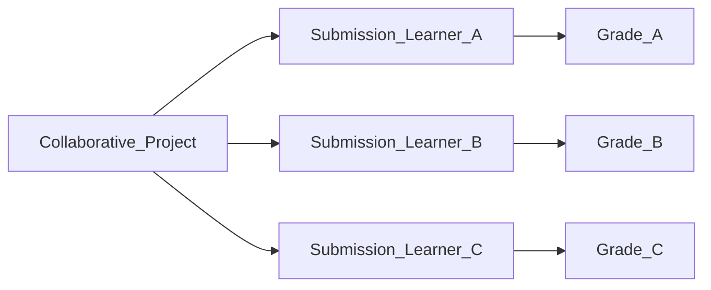
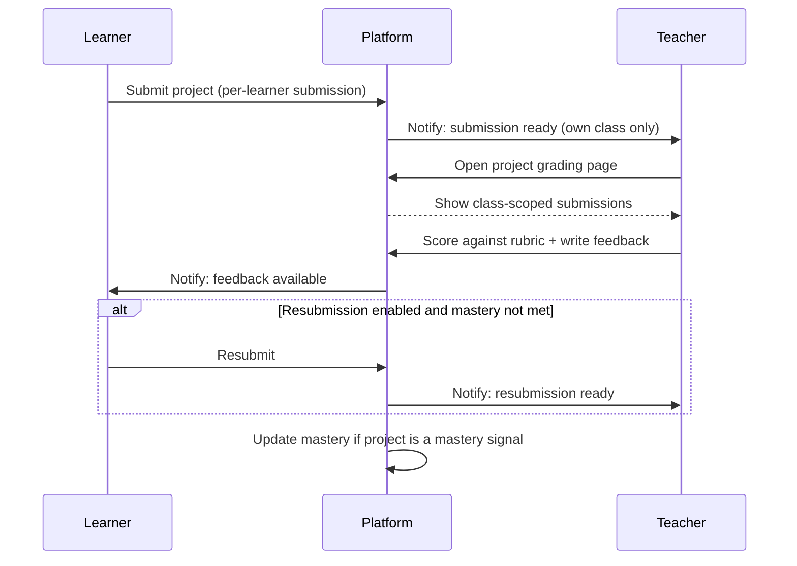

# 08 — Project-Based Learning

> How projects, submissions, and grading work in The-Code Adaptive LMS (`maestronexus`).

## Overview

Projects are a node type ([04_learning_graph_model.md](04_learning_graph_model.md)) for applied, often multi-session deliverables. They support rubrics, optional resubmission, and teacher grading, and they can contribute to mastery ([07_content_and_assessment_model.md](07_content_and_assessment_model.md)).

## Core rules

| Rule | Detail |
|------|--------|
| Per-learner submissions | Submissions are recorded per learner, even when the project is collaborative. Each learner gets their own submission and grade record. |
| Optional grading criteria | A project may define rubrics and criteria, or be ungraded. |
| Rubrics | Projects may attach a rubric with weighted criteria. |
| No forced submission limit | Unless explicitly configured (`max_submissions`), there is no cap on attempts. |
| Teacher grading page | Teachers have a dedicated project-grading page, placed in navigation **after the dashboard**. |
| Class-scoped grading | Teachers grade only projects from their own classes (object-level scope; see [02_personas_and_permissions.md](02_personas_and_permissions.md)). |
| Feedback and resubmission | Students see feedback and may resubmit if resubmission is enabled. |

## Collaborative projects, individual records

Even when learners collaborate, the system stores an individual `PROJECT_SUBMISSION` and an individual `GRADE` per learner. This keeps mastery and reporting learner-centric and avoids one shared grade masking individual contribution.

## Grading workflow

## Teacher grading page

- Appears in the teacher navigation directly **after the dashboard**.
- Lists only submissions from the teacher's own classes.
- Supports rubric-based scoring, free-text feedback, and (Future) AI-assisted draft feedback for the teacher to review and edit ([06_ai_tutor_and_agents.md](06_ai_tutor_and_agents.md)).
- Shows submission history per learner when resubmission is enabled.

## Resubmission

| Setting | Behavior |
|---------|----------|
| Resubmission disabled | Single submission; latest grade is final |
| Resubmission enabled | Learner may resubmit; each attempt is recorded (`attempt_no`) |
| `max_submissions` set | Hard cap on attempts |
| Mastery-linked | Resubmission encouraged until mastery rule is met (if project is a mastery signal) |

## Data entities

Projects use `PROJECT`, `PROJECT_SUBMISSION`, `RUBRIC`, `GRADE`, and `FEEDBACK` as defined in [12_data_model.md](12_data_model.md). Key fields: `PROJECT.collaborative`, `PROJECT.max_submissions`, `PROJECT_SUBMISSION.learner_id`, `PROJECT_SUBMISSION.attempt_no`, `GRADE.rubric_scores`.

## Implications for implementation

- Enforce per-learner submission and grade records at the data layer even for collaborative projects.
- Enforce class-scope on every project grading endpoint (teacher sees only own classes).
- Make submission limits opt-in; default to unlimited attempts.
- Place the grading page after the dashboard in teacher navigation (see [17_ux_principles.md](17_ux_principles.md)).

---

Repository: https://github.com/tamers76/maestronexus | Maintainer: The-Code.org / The-Code.ai
