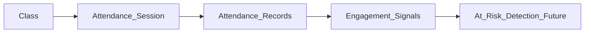

# 09 — Attendance and Reporting

> Attendance tracking, reports, and analytics in The-Code Adaptive LMS (`maestronexus`).

## Attendance

Attendance applies to classes, sessions, cohorts, or learning events.

| Capability | Detail |
|------------|--------|
| Mark attendance | Per session, per learner |
| View attendance reports | Per class / learner / period |
| Teacher visibility | Teachers see only their own classes (object-level scope; see [02_personas_and_permissions.md](02_personas_and_permissions.md)) |
| Admin visibility | Based on org scope/permission |
| Export | CSV/spreadsheet export |
| Engagement linkage | Attendance feeds engagement signals and at-risk detection |

### Model

Attendance uses `ATTENDANCE_SESSION` and `ATTENDANCE_RECORD` ([12_data_model.md](12_data_model.md)). A session belongs to a class and has a scheduled time and mode (in-person, online, hybrid). Each record marks a learner's status (`present`, `absent`, `late`, `excused`) with who marked it and when.

## Reports and analytics

Reports exist for learners, teachers, admins, and institution leaders, each scoped appropriately.

### Report catalog by persona

| Persona | Reports (MVP) | Reports (Future) |
|---------|---------------|------------------|
| Learner | Progress, completion, mastery, weak skills, upcoming tasks | Personalized improvement suggestions |
| Teacher | Class progress, completion, attendance, project grading status, learner risk indicators | Predicted at-risk learners, recommended interventions |
| Admin | Course/node usage, user activity, content approval status | Weak-node detection, course-improvement suggestions |
| Institution Leader | Outcomes, completion, engagement, teacher activity | Course effectiveness scoring, executive summaries |

### Analytics dimensions

- Progress, completion, mastery.
- Skill gaps, engagement, time spent.
- Assessment performance.
- At-risk learners (Future), course effectiveness (Future), node effectiveness (Future).
- Views by teacher, class, and institution.

## MVP vs Future analytics

| Capability | MVP | Future |
|------------|:---:|:------:|
| Progress / completion / mastery reports | ✅ | ✅ |
| Attendance reports & export | ✅ | ✅ |
| Class and learner views | ✅ | ✅ |
| Institution dashboards | Basic | Rich |
| Predict at-risk learners | ➖ | ✅ |
| Recommend interventions | ➖ | ✅ |
| Detect confusing/weak content & nodes | ➖ | ✅ |
| Suggest course improvements | ➖ | ✅ |
| Generate executive summaries | ➖ | ✅ |

Future AI analytics are produced by the Analytics Agent ([06_ai_tutor_and_agents.md](06_ai_tutor_and_agents.md)) and may export to BI tools ([10_integrations_and_interoperability.md](10_integrations_and_interoperability.md)).

## Notifications (summary)

The platform notifies users about assigned lessons, deadlines, missed activities, project feedback, teacher comments, AI recommendations, attendance alerts, parent updates, and admin announcements. Channels include in-app, email, SMS, WhatsApp, Microsoft Teams, and push. Channel/provider details live in [10_integrations_and_interoperability.md](10_integrations_and_interoperability.md); delivery is asynchronous via background workers ([11_system_architecture.md](11_system_architecture.md)).

## Implications for implementation

- Scope every attendance and report query by tenant and by object ownership (teacher → own classes).
- Compute reports from progress/mastery/attendance tables; precompute heavy aggregates via background jobs.
- Keep MVP analytics descriptive; reserve predictive analytics for the AI phase behind the same reporting API.

---

Repository: https://github.com/tamers76/maestronexus | Maintainer: The-Code.org / The-Code.ai
