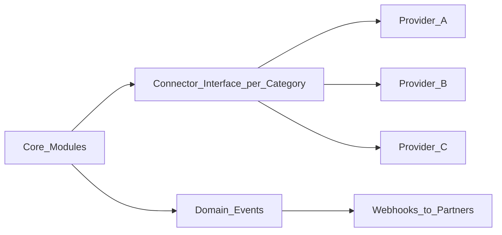

# 10 — Integrations and Interoperability

> The-Code Adaptive LMS (`maestronexus`) is API-first and integration-ready. Nothing is tightly coupled.

## Approach

- **API-first**: every important capability is exposed via the API ([13_api_strategy.md](13_api_strategy.md)).
- **Connector pattern**: one adapter interface per integration category; concrete providers plug in behind it.
- **Provider abstraction**: identity, AI, storage, and communications can be swapped without touching feature code.
- **Event-driven**: domain events (and webhooks) let external systems react to platform activity.

## Integration categories and priority

| # | Category | Examples | MVP priority |
|---|----------|----------|--------------|
| 6.1 | Identity | Microsoft Entra ID, Google Workspace, UAE Pass (if feasible), SIS, SAML, OAuth2, OIDC | MVP: OIDC/SAML login |
| 6.2 | Content standards & tools | SCORM, xAPI/Tin Can, LTI 1.3, H5P, Common Cartridge, QTI, external libraries | Phase 5 |
| 6.3 | Video & content generation | AI video, TTS, STT, avatar video, video hosting, YouTube/Vimeo embedding, internal media library | Internal media MVP; AI media Phase 3+ |
| 6.4 | Communication | Microsoft Teams, Zoom, Google Meet, Email, WhatsApp, SMS | Email MVP; others Phase 5 |
| 6.5 | Calendar | Outlook Calendar, Google Calendar, internal scheduling | Phase 5 |
| 6.6 | Payments | Stripe, PayPal, local gateways, bank transfer, invoicing | Future (commercial) |
| 6.7 | Analytics & BI | Power BI, Tableau, Looker, internal dashboards, data warehouse, Learning Record Store | Internal dashboards MVP; BI export Phase 4–5 |
| 6.8 | AI providers | OpenAI, Azure OpenAI, Anthropic, Google Gemini, local via Ollama, specialized media models | MVP via provider abstraction |
| 6.9 | Storage | Azure Blob, AWS S3, Google Cloud Storage, local dev | MVP (Azure Blob / MinIO) |
| 6.10 | Assessment & proctoring | Proctoring tools, exam engines, rubric tools, credentialing, badges | Future |

## Identity systems (6.1)

- MVP supports OIDC and SAML for SSO login, mapping external identities to users/roles within a tenant ([02_personas_and_permissions.md](02_personas_and_permissions.md)).
- UAE Pass and national identity systems are supported where feasible (open item in [19_open_questions.md](19_open_questions.md)).

## Content standards (6.2)

| Standard | Role |
|----------|------|
| LTI 1.3 | Launch external tools / be launched as a tool |
| SCORM | Import packaged content as `external_content` nodes |
| xAPI / Tin Can | Emit/consume learning activity statements to/from an LRS |
| Common Cartridge | Course import/export |
| QTI | Question/assessment interchange |
| H5P | Interactive content embedding |

These map external content into the internal node model ([04_learning_graph_model.md](04_learning_graph_model.md)); the (future) Integration Agent assists with mapping ([06_ai_tutor_and_agents.md](06_ai_tutor_and_agents.md)).

## AI providers (6.8)

All AI access is behind a provider-abstraction interface, enabling provider switching (Azure OpenAI, OpenAI, Anthropic, Gemini, local Ollama) without changing tutor or generation logic ([06_ai_tutor_and_agents.md](06_ai_tutor_and_agents.md), [11_system_architecture.md](11_system_architecture.md)).

## Communication & calendar (6.4, 6.5)

Notifications ([09_attendance_and_reporting.md](09_attendance_and_reporting.md)) deliver via in-app, email (MVP), and later SMS, WhatsApp, Teams, and push. Calendar integrations sync sessions and deadlines.

## Analytics & BI (6.7)

Internal dashboards ship in the MVP; data export to Power BI/Tableau/Looker and a Learning Record Store come in Phases 4–5. The platform can act as or feed an LRS via xAPI.

## Events and webhooks

Domain events (attempt completed, mastery changed, submission graded, content approved, attendance marked) can be delivered to partner systems via webhooks, and drive internal recompute/notifications ([13_api_strategy.md](13_api_strategy.md)).

## Implications for implementation

- Define a connector interface per category and ship MVP providers (OIDC/SAML, email, Azure Blob, one AI provider) behind it.
- Represent imported/external content as `external_content` nodes so the graph model stays uniform.
- Emit domain events from the start so integrations and analytics can subscribe without core changes.

---

Repository: https://github.com/tamers76/maestronexus | Maintainer: The-Code.org / The-Code.ai
