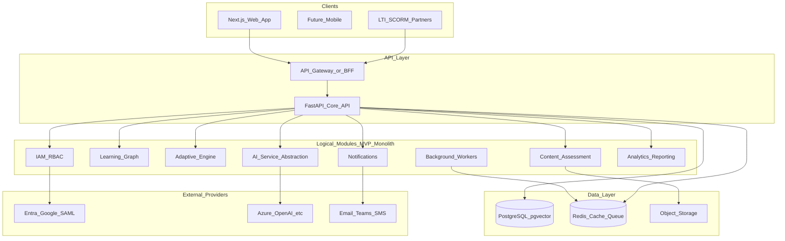
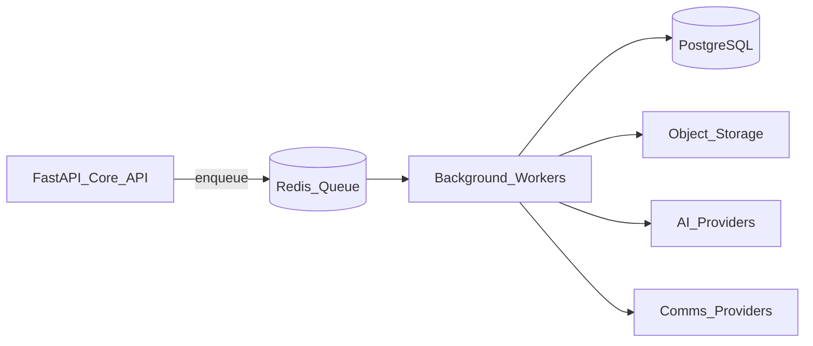
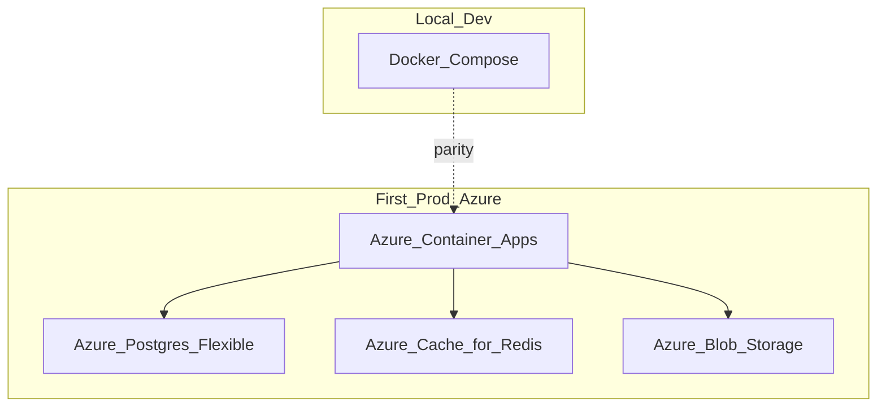

# 11 — System Architecture

> The architecture of The-Code Adaptive LMS (`maestronexus`): modular monolith first, API-first boundaries throughout.

## Architectural stance

- **API-first**: every important capability is exposed via a documented API ([13_api_strategy.md](13_api_strategy.md)).
- **Modular monolith for MVP**: one deployable FastAPI application with strict internal module boundaries.
- **Extraction-ready**: modules communicate through service interfaces and domain events so they can be split into services later without rewrites.

This is a deliberate trade-off: a premature microservices estate would slow the MVP and add operational burden. A disciplined modular monolith gives us clean boundaries now and an extraction path later. Full rationale in [18_technical_decisions.md](18_technical_decisions.md).

## Logical architecture

## Module boundaries (bounded contexts)

Each module is a Python package with a public service interface; cross-module access goes through that interface, never directly into another module's tables.

| Module | Owns | Key docs |
|--------|------|----------|
| `iam` | Tenants, users, roles, permissions, auth | [02](02_personas_and_permissions.md), [14](14_security_and_privacy.md) |
| `courses` (Learning Graph) | Courses, versions, nodes, dependencies, paths | [04](04_learning_graph_model.md) |
| `adaptive` | Recommendations, progress evaluation | [05](05_adaptive_learning_engine.md) |
| `content` | Content items, media, assessments, questions, projects | [07](07_content_and_assessment_model.md), [08](08_project_based_learning.md) |
| `ai` | Provider abstraction, tutor, RAG, content generation | [06](06_ai_tutor_and_agents.md) |
| `analytics` | Reports, attendance aggregation, dashboards | [09](09_attendance_and_reporting.md) |
| `notifications` | Multi-channel delivery | [09](09_attendance_and_reporting.md), [10](10_integrations_and_interoperability.md) |
| `integrations` | Connectors, standards adapters | [10](10_integrations_and_interoperability.md) |

## Worker layer

Background workers (Celery/ARQ on Redis) handle asynchronous work so API requests stay fast:

- AI generation and embedding/indexing.
- Media processing.
- Notification delivery.
- Imports and integration sync.
- Analytics aggregation and report precomputation.

## AI service layer

All LLM/embedding access is behind a provider-abstraction interface so providers (Azure OpenAI, OpenAI, Anthropic, Gemini, local via Ollama) are swappable. The AI module enforces grounding, guardrails, quotas, and logging ([06_ai_tutor_and_agents.md](06_ai_tutor_and_agents.md)).

## Integration layer

A connector pattern provides one adapter interface per integration category (identity, content standards, video/content generation, communications, calendar, payments, analytics/BI, AI, storage, proctoring). See [10_integrations_and_interoperability.md](10_integrations_and_interoperability.md).

## Multi-tenancy

**Recommendation for MVP: row-level isolation with `tenant_id` plus PostgreSQL Row-Level Security (RLS).**

| Strategy | Pros | Cons | Decision |
|----------|------|------|----------|
| Row-level (`tenant_id` + RLS) | Simple ops, one schema, cost-effective | Requires disciplined query scoping | **MVP choice** |
| Schema-per-tenant | Stronger isolation | Migration/ops complexity at scale | Revisit for large/regulated tenants |
| Database-per-tenant | Strongest isolation | Highest ops cost | Only for special cases |

Every tenant-scoped query is bound by `tenant_id`; RLS provides defense in depth (see [14_security_and_privacy.md](14_security_and_privacy.md)).

## Observability

- **Tracing**: OpenTelemetry across API and workers.
- **Logging**: structured, correlation-ID-tagged logs.
- **Metrics**: request latency, error rates, queue depth, AI token/cost usage.
- **Audit trail**: privileged actions written to `AUDIT_LOG` ([12_data_model.md](12_data_model.md)).

## Deployment view

- **Dev**: Docker Compose (API, worker, Postgres+pgvector, Redis, MinIO).
- **First prod**: Azure Container Apps + Azure Database for PostgreSQL + Azure Cache for Redis + Azure Blob Storage.
- **Later**: AKS when independent scaling/team ownership justifies the move ([18_technical_decisions.md](18_technical_decisions.md)).

## Extraction triggers (monolith → services)

Extract a module into its own service when one of these is true:
- It needs independent scaling (AI workers are the likeliest first).
- A separate team must own its lifecycle.
- Compliance requires isolation.
- Integration blast radius must be contained.

Likely first extractions: **AI workers**, **notification service**, **analytics pipeline**.

## Implications for implementation

- Enforce module boundaries in code (no cross-module DB imports); communicate via service interfaces and domain events.
- Make everything tenant-scoped and observable from day one.
- Keep provider integrations behind abstractions so the monolith can be split and providers swapped without churn.

---

Repository: https://github.com/tamers76/maestronexus | Maintainer: The-Code.org / The-Code.ai
