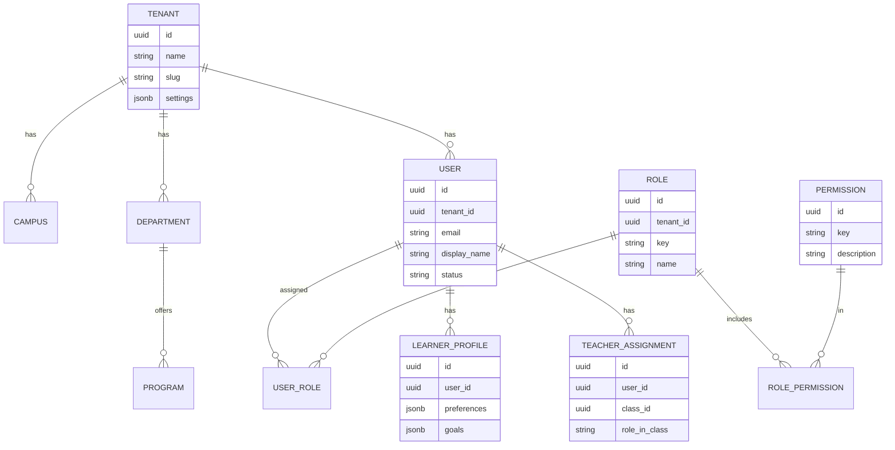
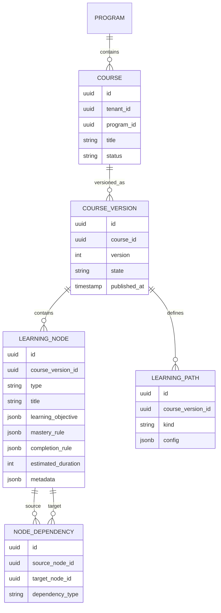
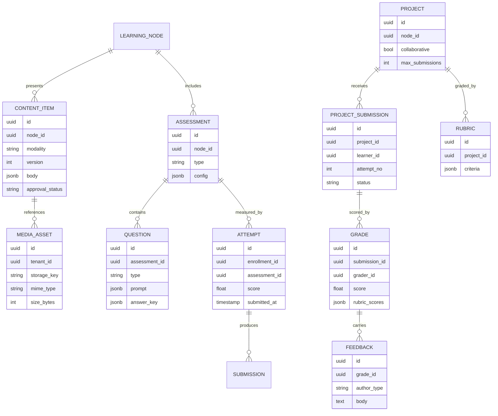
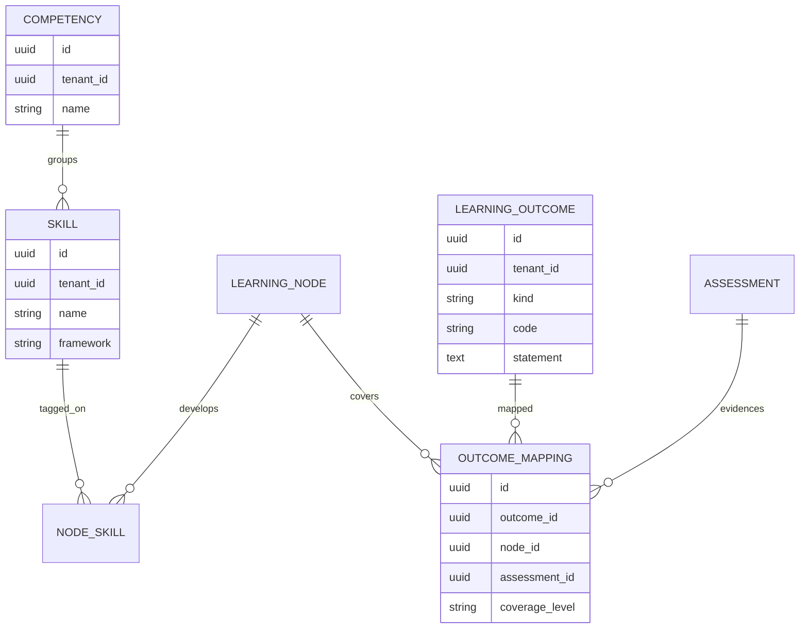
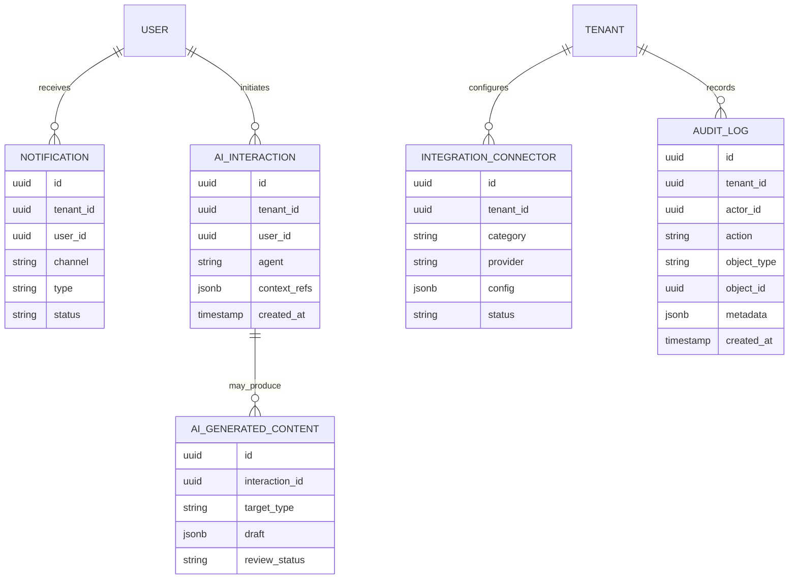

# 12 — Data Model

> Core entities and relationships for The-Code Adaptive LMS (`maestronexus`). This is a conceptual model, not a final migration.

## Conventions

- **Every tenant-owned table carries `tenant_id`** (multi-tenant isolation; see [14_security_and_privacy.md](14_security_and_privacy.md)).
- **UUID primary keys** (`id`) for all entities.
- **Soft deletes** via `deleted_at` for recoverable records (enrollments, content, submissions).
- **Auditing fields** `created_at`, `updated_at`, `created_by` on mutable entities.
- **Versioning**: courses and content use explicit version entities rather than in-place mutation of published artifacts.
- **Embeddings**: `pgvector` columns live on content/index tables, not on hot transactional tables.

## Entity groups

The model is organized into five subgraphs: Organization & Identity, Course Graph, Enrollment & Progress, Content & Assessment, and Skills & Outcomes. Cross-cutting entities (Notification, AI Interaction, AI Generated Content, Integration Connector, Audit Log) attach across groups.

### Organization & Identity



### Course Graph



### Enrollment & Progress

```mermaid
erDiagram
  CLASS ||--o{ ENROLLMENT : has
  COURSE_VERSION ||--o{ ENROLLMENT : pinned_to
  USER ||--o{ ENROLLMENT : enrolls
  ENROLLMENT ||--o{ NODE_PROGRESS : tracks
  LEARNING_NODE ||--o{ NODE_PROGRESS : for
  ENROLLMENT ||--o{ MASTERY_RECORD : accrues
  ENROLLMENT ||--o{ RECOMMENDATION : receives

  CLASS {
    uuid id
    uuid tenant_id
    uuid course_id
    uuid teacher_id
    string name
  }
  ENROLLMENT {
    uuid id
    uuid tenant_id
    uuid user_id
    uuid class_id
    uuid course_version_id
    string status
  }
  NODE_PROGRESS {
    uuid id
    uuid enrollment_id
    uuid node_id
    string state
    int attempts
    int time_spent_seconds
    float confidence
    timestamp completed_at
  }
  MASTERY_RECORD {
    uuid id
    uuid enrollment_id
    uuid node_id
    uuid skill_id
    float score
    string status
    jsonb evidence
  }
  RECOMMENDATION {
    uuid id
    uuid enrollment_id
    uuid recommended_node_id
    string reason
    string source
    timestamp created_at
  }
```

### Content & Assessment



### Skills & Outcomes



### Attendance

```mermaid
erDiagram
  CLASS ||--o{ ATTENDANCE_SESSION : schedules
  ATTENDANCE_SESSION ||--o{ ATTENDANCE_RECORD : has
  USER ||--o{ ATTENDANCE_RECORD : marked_for

  ATTENDANCE_SESSION {
    uuid id
    uuid tenant_id
    uuid class_id
    timestamp scheduled_at
    string mode
  }
  ATTENDANCE_RECORD {
    uuid id
    uuid session_id
    uuid learner_id
    string status
    timestamp marked_at
    uuid marked_by
  }
```

### Cross-cutting entities



## Entity reference

| Entity | Group | Notes |
|--------|-------|-------|
| Tenant / Institution | Org | Isolation boundary |
| Campus | Org | Optional physical/logical site |
| Department | Org | Groups programs |
| Program | Org | Groups courses; PLOs attach here |
| Course | Course Graph | Editable container |
| Course Version | Course Graph | Immutable published snapshot |
| Learning Node | Course Graph | Atomic learning unit |
| Node Dependency | Course Graph | Directed edge with type |
| Learning Path | Course Graph | Named path configuration |
| Class / Cohort | Enrollment | Teacher-owned group |
| Enrollment | Enrollment | Learner ↔ class ↔ version |
| User | Identity | Any actor |
| Role / Permission | Identity | RBAC (see [02](02_personas_and_permissions.md)) |
| Teacher Assignment | Identity | Teacher ↔ class scope |
| Learner Profile | Identity | Preferences, goals |
| Content Item | Content | Modality-specific body, versioned |
| Media Asset | Content | Object-storage reference |
| Assessment / Question | Assessment | Question bank + config |
| Attempt / Submission | Assessment | Learner responses |
| Project / Project Submission | Projects | Per-learner submissions |
| Rubric / Grade / Feedback | Projects | Grading artifacts |
| Attendance Session / Record | Attendance | Class-scoped |
| Skill / Competency | Skills | Trackable capabilities |
| Learning Outcome | Outcomes | CLO/PLO |
| Outcome Mapping | Outcomes | Coverage matrix |
| Mastery Record | Progress | Mastery evidence |
| Recommendation | Progress | Adaptive engine output |
| AI Interaction | Cross-cutting | Tutor/agent calls |
| AI Generated Content | Cross-cutting | Drafts pending review |
| Notification | Cross-cutting | Multi-channel |
| Integration Connector | Cross-cutting | Provider config |
| Audit Log | Cross-cutting | Privileged action trail |

## Indexing and performance notes

- Composite index on `(tenant_id, ...)` for every tenant-scoped query path.
- `NODE_PROGRESS` indexed by `(enrollment_id, node_id)` and `(enrollment_id, state)` for journey rendering.
- `NODE_DEPENDENCY` indexed by both `source_node_id` and `target_node_id` for forward/backward traversal.
- Vector indexes (`pgvector` HNSW/IVF) only on content/index tables used by RAG (see [06_ai_tutor_and_agents.md](06_ai_tutor_and_agents.md)).
- `AUDIT_LOG` is append-only and partitioned by time.

## Implications for implementation

- Keep the course graph (definition) separate from per-learner progress (state). The graph is shared/immutable per version; progress is per enrollment.
- Mastery records are the source of truth for `mastery_gate` evaluation in [04_learning_graph_model.md](04_learning_graph_model.md).
- AI-generated content is never directly published — it lands in `AI_GENERATED_CONTENT` with `review_status` and flows into `CONTENT_ITEM` only after approval (see [07_content_and_assessment_model.md](07_content_and_assessment_model.md)).

---

Repository: https://github.com/tamers76/maestronexus | Maintainer: The-Code.org / The-Code.ai
