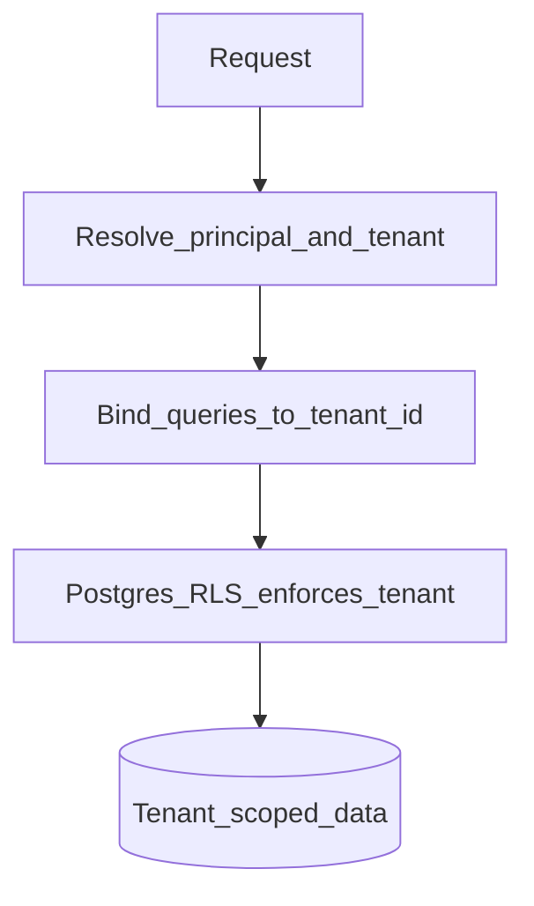

# 14 — Security and Privacy

> Security and privacy expectations for The-Code Adaptive LMS (`maestronexus`). This is design guidance, not legal advice.

## Security objectives

- Protect learner data (sensitive, often involving minors).
- Guarantee tenant isolation.
- Enforce least-privilege access at role and object level.
- Maintain an auditable trail of privileged actions.
- Keep AI safe, grounded, and integrity-preserving.

## Controls overview

| Area | Control |
|------|---------|
| Authentication | OIDC/SSO login; JWT access + refresh tokens; MFA where supported by IdP |
| Authorization | RBAC + object-level scopes on every endpoint ([02_personas_and_permissions.md](02_personas_and_permissions.md)) |
| Tenant isolation | `tenant_id` on all tenant data + PostgreSQL Row-Level Security ([11_system_architecture.md](11_system_architecture.md)) |
| Encryption in transit | TLS everywhere |
| Encryption at rest | DB and object-storage encryption; secrets in a managed vault |
| Secure file access | Short-lived signed URLs for media; no public buckets |
| Input validation | Strict schema validation; reject unknown fields |
| Rate limiting | Per-principal and per-tenant; stricter on AI endpoints |
| Secure API design | Consistent authz dependency; no tenant trust from request body ([13_api_strategy.md](13_api_strategy.md)) |
| Audit logging | Append-only `AUDIT_LOG`, time-partitioned ([12_data_model.md](12_data_model.md)) |
| Observability | Tracing, structured logs, anomaly-friendly metrics |

## Authorization model (recap)

Every request passes four gates, in order: authentication → tenant match → role capability → object scope; then the action is audited. The flow diagram is in [02_personas_and_permissions.md](02_personas_and_permissions.md).

## Tenant isolation

- Tenant is derived from the authenticated principal, never from client input.
- RLS provides defense-in-depth even if an application query forgets a filter.
- Cross-tenant access is reserved for explicit Super Admin operations and is audited.

## Threat model (summary)

| Threat | Mitigation |
|--------|------------|
| Cross-tenant data access | `tenant_id` scoping + RLS |
| Privilege escalation | RBAC + object scope; deny by default |
| Broken object-level access (IDOR) | Object scope checks on every resource fetch |
| Injection (SQL/prompt) | Parameterized queries; AI input sanitization & grounding |
| Sensitive data exposure | Encryption, signed URLs, PII minimization |
| Abuse / cost overrun on AI | Rate limits, per-tenant quotas/budgets |
| Credential theft | Short-lived tokens, refresh rotation, MFA via IdP |
| Audit tampering | Append-only, partitioned audit log |

Controls map to OWASP Top 10 and OWASP API Security Top 10 categories.

## AI safety and academic integrity

Guardrails (detailed in [06_ai_tutor_and_agents.md](06_ai_tutor_and_agents.md)):
- **Grounding**: tutor responses must be supported by approved content; otherwise fall back/escalate.
- **Assessment integrity**: detect graded-item context and refuse to provide answers; coach instead.
- **PII protection**: minimize learner PII in prompts; never expose other users' data.
- **Logging**: all AI interactions recorded for audit and quality review.
- **Human-in-the-loop**: AI-generated content is never published without human approval ([07_content_and_assessment_model.md](07_content_and_assessment_model.md)).

## Privacy-aware learner data handling

| Principle | Practice |
|-----------|----------|
| Data minimization | Collect only what the learning experience needs |
| Purpose limitation | Use learner data for learning, not unrelated profiling |
| Access control | Strict role + object scope; parents see only linked learners (future) |
| Retention | Configurable retention; soft-delete then purge |
| Portability/erasure | Support export and deletion requests |
| Minors | Heightened care; guardian consent flows (future) |

## Compliance-ready architecture

The architecture is designed to support compliance regimes such as FERPA and GDPR (data subject rights, consent, retention, audit). Specific legal applicability and certification are open items in [19_open_questions.md](19_open_questions.md). This document does not constitute legal advice.

## Implications for implementation

- Implement a single shared authorization dependency (tenant + RBAC + object scope) and apply it to every route.
- Enable Postgres RLS as defense-in-depth; do not rely on application filtering alone.
- Treat AI guardrails as server-side enforcement, not prompt suggestions.
- Write audit entries for all privileged and AI actions.

---

Repository: https://github.com/tamers76/maestronexus | Maintainer: The-Code.org / The-Code.ai
