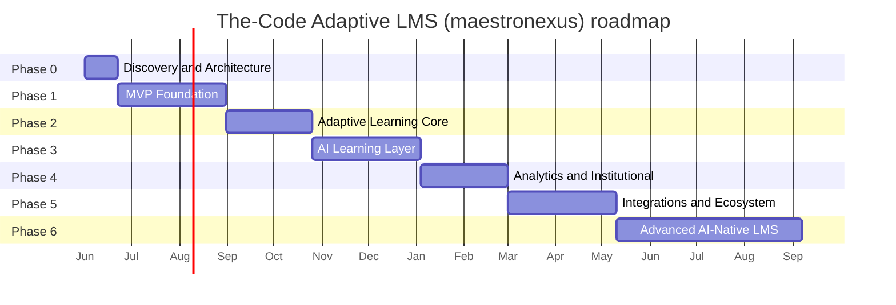
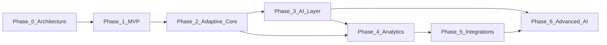

# 16 — Roadmap

> Phased delivery plan for The-Code Adaptive LMS (`maestronexus`). Durations are indicative (T-shirt) estimates, not commitments.

## Phase overview

| Phase | Theme | Indicative duration | Primary outcome |
|-------|-------|---------------------|-----------------|
| 0 | Discovery & Architecture | 2–4 weeks | Shared foundation (this docs set) |
| 1 | MVP Foundation | 8–12 weeks | Auth, roles, course/node model, dashboards, basic progress |
| 2 | Adaptive Learning Core | 6–10 weeks | Dependencies, mastery, recommendation engine, graph UI |
| 3 | AI Learning Layer | 8–12 weeks | Grounded tutor, AI content generation, RAG, guardrails |
| 4 | Analytics & Institutional | 6–10 weeks | Dashboards, at-risk, effectiveness, outcome mapping |
| 5 | Integrations & Ecosystem | 8–12 weeks | SCORM, xAPI, LTI, Teams, Zoom, SIS, BI |
| 6 | Advanced AI-Native LMS | Ongoing | Multi-agent orchestration, predictive, adaptive multimodal |

## Timeline

## Phase details

### Phase 0 — Discovery and Architecture
Product vision, personas, domain model, architecture, UX flows, data model, API strategy, security model. **Deliverable:** this documentation set in `maestronexus`.

### Phase 1 — MVP Foundation
Auth, roles, course model, node model, learner enrollment, teacher dashboard, learner dashboard, basic progress. Aligns with [15_mvp_scope.md](15_mvp_scope.md) items 1–13, 17–18, 21–23.

### Phase 2 — Adaptive Learning Core
Node dependencies, mastery rules, rule-based recommendation engine ([05](05_adaptive_learning_engine.md)), remediation paths, skill tracking, and the visual learning-graph UI ([04](04_learning_graph_model.md)).

### Phase 3 — AI Learning Layer
Grounded AI tutor, AI content generation, AI quiz generation, AI feedback assistance, RAG over approved course content, and AI guardrails ([06](06_ai_tutor_and_agents.md), [07](07_content_and_assessment_model.md)).

### Phase 4 — Analytics and Institutional Layer
Dashboards, at-risk learners, course effectiveness, outcome mapping, institution reports ([09](09_attendance_and_reporting.md)).

### Phase 5 — Integrations and Ecosystem
SCORM, xAPI, LTI, Teams, Zoom, SIS, Power BI, external content providers ([10](10_integrations_and_interoperability.md)).

### Phase 6 — Advanced AI-Native LMS
Multi-agent orchestration, personalized learning journeys, automated remediation generation, adaptive multimodal content, predictive interventions, and AI-powered course improvement ([06](06_ai_tutor_and_agents.md)).

## Phase dependencies

## Risk register

| Phase | Risk | Mitigation |
|-------|------|------------|
| 1 | Scope creep into adaptive/AI early | Hold the line on [15_mvp_scope.md](15_mvp_scope.md) |
| 2 | Graph editor complexity | Start with basic React Flow editor; iterate |
| 3 | AI hallucination / integrity | Enforce grounding + guardrails server-side ([06](06_ai_tutor_and_agents.md)) |
| 3 | AI cost overrun | Per-tenant quotas/budgets, rate limits ([14](14_security_and_privacy.md)) |
| 4 | Analytics needs clean data | Emit domain events from Phase 1 to accrue data early |
| 5 | Standards integration effort | Sequence by demand; reuse connector pattern ([10](10_integrations_and_interoperability.md)) |
| 6 | Multi-agent reliability | Keep rules as the safety net; human-in-the-loop |
| All | Premature microservices | Modular monolith until extraction triggers fire ([11](11_system_architecture.md)) |

## Implications for implementation

- Treat Phase 0 (this docs set) as the contract; begin Phase 1 against [15_mvp_scope.md](15_mvp_scope.md) acceptance criteria.
- Emit domain events from Phase 1 so later analytics and AI phases have data to learn from.
- Keep provider abstractions in place so Phases 3 and 5 integrate without core rewrites.

---

Repository: https://github.com/tamers76/maestronexus | Maintainer: The-Code.org / The-Code.ai
