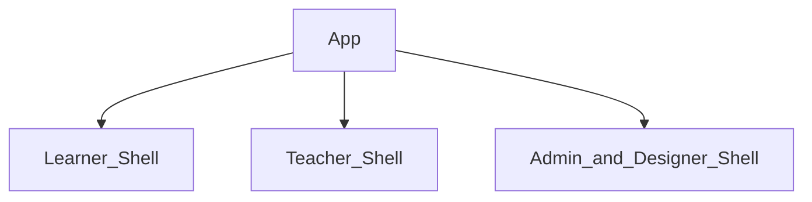
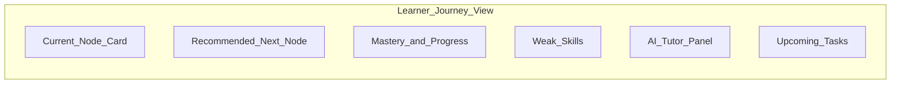
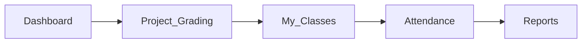
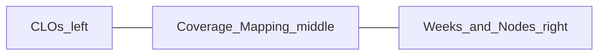

# 17 — UX Principles

> How The-Code Adaptive LMS (`maestronexus`) should feel: modern, clean, serious — not a legacy LMS.

## Design tenets

1. **Clarity of journey** — the learner always knows where they are and what comes next.
2. **Make the next step obvious** — one primary call-to-action per screen, with the recommendation `reason` shown.
3. **Make progress visible** — mastery, completion, and skill growth are always at hand.
4. **Visualize the learning graph** — paths are shown as graphs, nodes as cards.
5. **Simple for teachers** — class-scoped, low-clutter, fast grading.
6. **Powerful for admins/designers** — depth without overwhelming the everyday user.
7. **AI used naturally, not as a gimmick** — assistance appears in context, never as a novelty.
8. **Avoid clutter** — progressive disclosure over dense dashboards.
9. **Accessible by default** — target WCAG 2.1 AA.

## Information architecture: three shells

The product is organized into three role-based shells, selected by role ([02_personas_and_permissions.md](02_personas_and_permissions.md)).

### Learner shell — Journey View

The learner sees:
- Current node and recommended next node (with reason).
- Completed nodes and locked nodes.
- Weak skills and mastery level.
- AI tutor access.
- Upcoming tasks/deadlines.

### Teacher shell

The teacher sees: My classes, my learners, my assigned lessons, attendance, reports, project grading, and learner risk indicators. Navigation order places **project grading directly after the dashboard** ([08_project_based_learning.md](08_project_based_learning.md)).

### Admin / Designer shell

The admin/designer sees: the course graph, nodes, dependencies, content, outcomes, assessments, analytics, and AI generation tools. The centerpiece is the visual graph editor ([04_learning_graph_model.md](04_learning_graph_model.md)).

## Component patterns

| Pattern | Use |
|---------|-----|
| Node cards | Represent each learning node with type, status, and duration |
| Graph canvas | Visualize and edit the learning graph (React Flow) |
| Progress rings / bars | Show mastery and completion at a glance |
| Next-step CTA | One prominent action with explanation |
| Dashboards | Role-scoped insight summaries |
| Inline AI assist | Contextual tutor/draft actions, not separate destinations |
| Empty states | Guide first actions (create node, enroll learner) |

## Outcome mapping UI (designer)

A visual coverage view: CLOs on the left, weeks/nodes on the right, coverage mapping in the middle — helping designers distribute outcomes across the course ([07_content_and_assessment_model.md](07_content_and_assessment_model.md)).

## Accessibility baseline

- WCAG 2.1 AA target: color contrast, keyboard navigation, focus order, semantic landmarks.
- Captions/transcripts for video and audio content.
- Respect reduced-motion preferences for graph animations.

## Implications for implementation

- Build the three shells as distinct navigations over shared components.
- Always render the recommendation `reason` near the next-step CTA.
- Treat the graph editor and Journey View as the two signature surfaces; invest UX effort there first.

---

Repository: https://github.com/tamers76/maestronexus | Maintainer: The-Code.org / The-Code.ai
